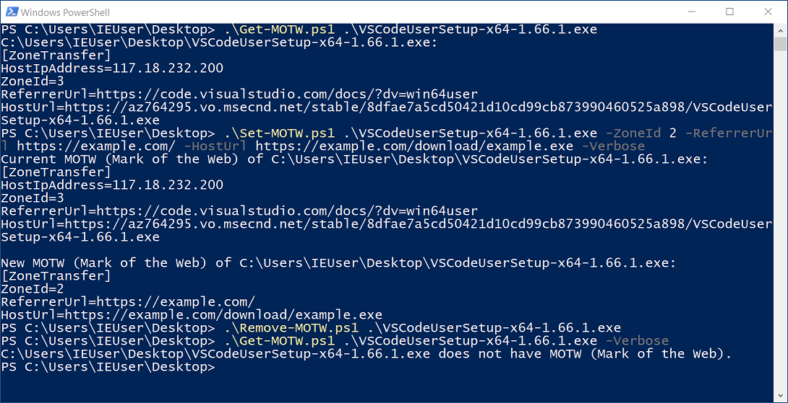

# PS-MOTW: PowerShell scripts to set / show / remove MOTW (Mark of the Web)



MOTW (Mark of the Web) is an attribute to indicate the origin ([URL Security Zones](https://docs.microsoft.com/en-us/previous-versions/windows/internet-explorer/ie-developer/platform-apis/ms537183(v=vs.85))) of a file. Applications such as web browsers and email clients set MOTW for downloaded files and email attachments that come from the internet. MOTW is stored in Zone.Identifier NTFS alternate data stream.

Though MOTW can be removed with Windows Explorer by [ticking the "Unblock" checkbox](https://support.microsoft.com/en-us/topic/block-suspicious-macros-in-office-on-windows-10-s-60785abc-d8b8-4b80-8f5d-67ddbee213e9) in the file properties window or with [Unblock-File PowerShell cmdlet](https://docs.microsoft.com/ja-jp/powershell/module/microsoft.powershell.utility/unblock-file?view=powershell-7.1), Windows does not provide similar functions to manually set or show MOTW. So I created the following PowerShell scripts. These scripts can be used to create example files for testing digital forensic tools, defense mechanism of Microsoft Office, and so on.

- [Set-MOTW.ps1](https://github.com/nmantani/PS-MOTW#set-motwps1)
- [Get-MOTW.ps1](https://github.com/nmantani/PS-MOTW#get-motwps1)
- [Remove-MOTW.ps1](https://github.com/nmantani/PS-MOTW#remove-motwps1)

How to use these script is described as follows. You can also use `Get-Help` cmdlet to see the same information.

## Set-MOTW.ps1
Set-MOTW.ps1 sets MOTW for specified files. If a directory is specified, all files under the directory are processed recursively. The * wildcard can be used to specify multiple files. Only the `-Verbose` parameter is supported in CommonParameters.

### Usage
```powershell
.\Set-MOTW.ps1 [-Path] <String> [[-ZoneId] <Int16>] [[-ReferrerUrl] <String>]
 [[-HostUrl] <String>] [[-HostIpAddress] <String>] [[-LastWriterPackageFamilyName] <String>]
 [[-AppZoneId] <Int16>] [[-AppDefinedZoneId] <Int16>] [<CommonParameters>]
```

### Parameters
- Path  
Specifies the path to set MOTW. This parameter is mandatory.

- ZoneId  
Specifies the ZoneId value (default: 3):  
0: Local machine (URLZONE_LOCAL_MACHINE)  
1: Local intranet (URLZONE_INTRANET)  
2: Trusted sites (URLZONE_TRUSTED)  
3: Internet (URLZONE_INTERNET)  
4: Untrusted sites (URLZONE_UNTRUSTED)  
This parameter is always set unless AppZoneId is specified.

- ReferrerUrl  
Specifies the string for ReferrerUrl of MOTW (default: undefined). Google Chrome, Microsoft Edge (Blink-based), and Mozilla Firefox set this value.

- HostUrl  
Specifies the string for HostUrl of MOTW (default: undefined). Google Chrome, Microsoft Edge (Blink-based), and Mozilla Firefox set this value.

- HostIpAddress  
Specifies the string for HostIpAddress of MOTW (default: undefined). Legacy Microsoft Edge (EdgeHTML-based) sets this value.

- LastWriterPackageFamilyName  
Specifies the string for LastWriterPackageFamilyName of MOTW (default: undefined). Legacy Microsoft Edge (EdgeHTML-based) sets this value.

- AppZoneId  
Specifies AppZoneId of MOTW (default: undefined). AppDefinedZoneId and ZoneId cannot be used if this parameter is specified. Old versions of SmartScreen set `AppZoneId=4` and remove ZoneId for an executable file when execution permission is given by clicking the "Run anyway" button. Recent versions of SmartScreen seem to just remove Zone.Identifier alternate data stream instead of setting `AppZoneId=4`.

- AppDefinedZoneId  
Specifies AppDefinedZoneId of MOTW (default: undefined). The purpose of AppDefinedZoneId is unknown and it is only mentioned in the [Zone.Identifier alternate data stream format](https://docs.microsoft.com/en-us/previous-versions/windows/internet-explorer/ie-developer/platform-apis/mt243886(v=vs.85)#zoneidentifier-alternate-data-stream-format) section of the document of [IZoneIdentifier2 interface](https://docs.microsoft.com/en-us/previous-versions/windows/internet-explorer/ie-developer/platform-apis/mt243886(v=vs.85)).

### Examples
```powershell
# Marking a Word document file as downloaded with web browsers.
# New MOTW information is shown with -Verbose option.

PS> .\Set-MOTW.ps1 example.docx -ReferrerUrl https://example.com/ -HostUrl https://example.com/download/example.docx -Verbose
New MOTW (Mark of the Web) of C:\Users\user\Desktop\example.docx:
[ZoneTransfer]
ZoneId=3
ReferrerUrl=https://example.com/
HostUrl=https://example.com/download/example.docx
PS> 
```

```powershell
# Overwriting existing MOTW of example.zip with new MOTW to simulate the behavior of Legacy Microsoft Edge
# (EdgeHTML-based) when a file is downloaded with the "Save target as" context menu and saved to
# non-default location.

PS> .\Set-MOTW.ps1 example.zip -ReferrerUrl https://example.net/ -HostUrl https://example.net/example.zip -HostIpAddress 192.168.100.100 -Verbose
Current MOTW (Mark of the Web) of C:\Users\user\Desktop\example.zip:
[ZoneTransfer]
ZoneId=3
ReferrerUrl=https://example.com/
HostUrl=https://example.com/download/example.zip

New MOTW (Mark of the Web) of C:\Users\user\Desktop\example.zip:
[ZoneTransfer]
HostIpAddress=192.168.100.100
ZoneId=3
ReferrerUrl=https://example.net/
HostUrl=https://example.net/example.zip
PS>
```

```powershell
# Marking multiple JPEG files as downloaded from trusted sites (ZoneId = 2) with web browsers.

PS> .\Set-MOTW.ps1 *.jpg -ZoneId 2 -ReferrerUrl https://example.com/ -HostUrl https://example.com/download/
PS>
```

```powershell
# Simulating the behavior of "Extract all" built-in function of Windows Explorer that sets ReferrerUrl
# for extracted files to the path of a ZIP archive file.

PS> .\Set-MOTW.ps1 example\*.png -ReferrerUrl C:\Users\user\Desktop\example.zip
PS>
```

```powershell
# Simulating the behavior of old versions of SmartScreen that set AppZoneId=4 for an executable file.

PS> .\Set-MOTW.ps1 example.exe -AppZoneId 4
PS>
```

```powershell
# Marking all files under C:\Users\user\Downloads with the parameters LastWriterPackageFamilyName
# and AppDefinedZoneId.

PS> .\Set-MOTW.ps1 C:\Users\user\Downloads -LastWriterPackageFamilyName Microsoft.Office.OneNote_8wekyb3d8bbwe -AppDefinedZoneId 0
PS>
```

## Get-MOTW.ps1
Get-MOTW.ps1 shows MOTW (Mark of the Web) of specified files. If a directory is specified, all files under the directory are processed recursively. The * wildcard can be used to specify multiple files. Only the `-Verbose` parameter is supported in CommonParameters.
### Usage
```powershell
.\Get-MOTW.ps1 [-Path] <String> [<CommonParameters>]
```
### Parameters
- Path  
Specifies the path to show MOTW. This parameter is mandatory.

### Examples
```powershell
# Showing MOTW of example.docx.

PS> .\Get-MOTW.ps1 example.docx
C:\Users\user\Desktop\example.docx:
[ZoneTransfer]
ZoneId=3
ReferrerUrl=https://example.com/
HostUrl=https://example.com/download/
PS>
```

```powershell
# Showing MOTW of multiple Word document files.

PS> .\Get-MOTW.ps1 *.docx
C:\Users\user\Desktop\example1.docx:
[ZoneTransfer]
ZoneId=3
ReferrerUrl=https://example.com/
HostUrl=https://example.com/download/

C:\Users\user\Desktop\example2.docx:
[ZoneTransfer]
ZoneId=3
ReferrerUrl=https://example.com/
HostUrl=https://example.com/download/
PS>
```

```powershell
# Showing MOTW of all files under C:\Users\user\Documents .

PS> .\Get-MOTW.ps1 C:\Users\user\Documents
C:\Users\user\Documents\word\example.docx:
[ZoneTransfer]
ZoneId=3
ReferrerUrl=https://example.com/
HostUrl=https://example.com/download/

C:\Users\user\Documents\excel\example.xlsx:
[ZoneTransfer]
ZoneId=3
ReferrerUrl=https://example.com/
HostUrl=https://example.com/download/
PS>
```

## Remove-MOTW.ps1
Remove-MOTW.ps1 removes MOTW (Mark of the Web) from specified files. If a directory is specified, all files under the directory are processed recursively. The * wildcard can be used to specify multiple files. Only the "-Verbose" parameter is supported in CommonParameters.
### Usage
```powershell
.\Remove-MOTW.ps1 [-Path] <String> [<CommonParameters>]
```

### Parameters
- Path  
Specifies the path to remove MOTW. This parameter is mandatory.

### Examples
```powershell
# Removing MOTW from example.docx.

PS> .\Remove-MOTW.ps1 example.docx
PS>
```

```powershell
# Removing MOTW from multiple JPEG files.

PS> .\Remove-MOTW.ps1 *.jpg
PS>
```

```powershell
# Removing MOTW from all files under C:\Users\user\Downloads .

PS> .\Remove-MOTW.ps1 C:\Users\user\Downloads
PS>
```

## See also
[Comparison of MOTW (Mark of the Web) support of archiver software for Windows](https://github.com/nmantani/archiver-MOTW-support-comparison/)

## References
- [Details about the Mark-of-the-Web (MOTW)](https://nolongerset.com/mark-of-the-web-details/) by Mike Wolfe ([@NoLongerSet](https://twitter.com/NoLongerSet))
- [Downloads and the Mark-of-the-Web](https://textslashplain.com/2016/04/04/downloads-and-the-mark-of-the-web/) by Eric Lawrence ([@ericlaw](https://twitter.com/ericlaw))
- [Mark-of-the-Web from a red team’s perspective](https://outflank.nl/blog/2020/03/30/mark-of-the-web-from-a-red-teams-perspective/) by Stan Hegt ([@stanhacked](https://twitter.com/stanhacked))
- [Forensic Analysis of the Zone.Identifier Stream](https://www.digital-detective.net/forensic-analysis-of-zone-identifier-stream/) by Craig Wilson
- [Zone Identifier == kMDItemWhereFroms?](https://thinkdfir.com/2018/06/17/zone-identifier-kmditemwherefroms/) by Phill Moore ([@phillmoore](https://twitter.com/phillmoore))
- [Highway To The Danger Zone.Identifier](https://www.dfir.co.za/2018/06/18/highway-to-the-danger-zone-identifier/) by Jaco ([@jaco_ZA](https://twitter.com/jaco_ZA))
- [How Microsoft SmartScreen works and how it stores data in NTFS streams](http://blog.lesc.se/2015/09/how-microsoft-smartscreen-works-and-how.html) by Lennart Schedin
- [Windows 10 における Zone Identifier の挙動：Web ブラウザによって異なる記録内容](https://soji256.hatenablog.jp/entry/2018/09/07/071500) (written in Japanese) by soji256 ([@soji256](https://twitter.com/soji256))
- [About URL Security Zones](https://docs.microsoft.com/en-us/previous-versions/windows/internet-explorer/ie-developer/platform-apis/ms537183(v=vs.85)?redirectedfrom=MSDN) (Microsoft)
- [IZoneIdentifier2 interface](https://docs.microsoft.com/en-us/previous-versions/windows/internet-explorer/ie-developer/platform-apis/mt243886(v=vs.85)) (Microsoft)

## Author
Nobutaka Mantani (Twitter: [@nmantani](https://twitter.com/nmantani))

## License
The BSD 2-Clause License (http://opensource.org/licenses/bsd-license.php)
